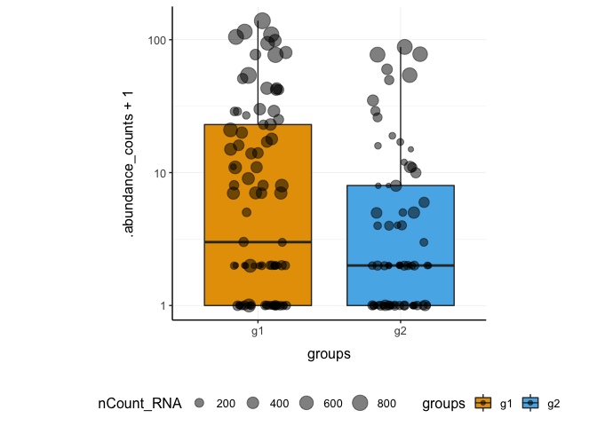
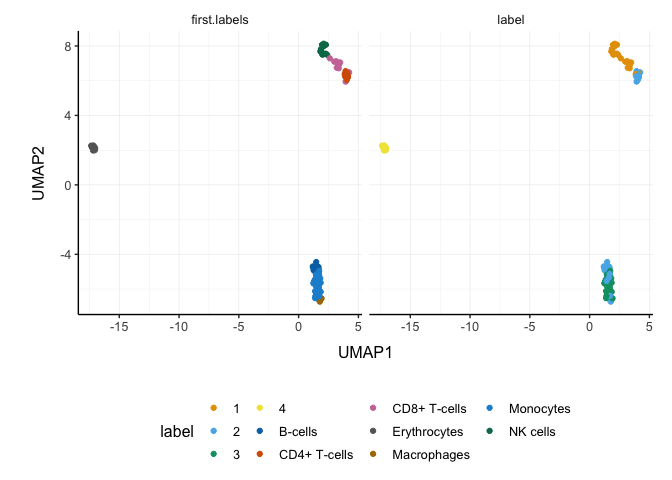
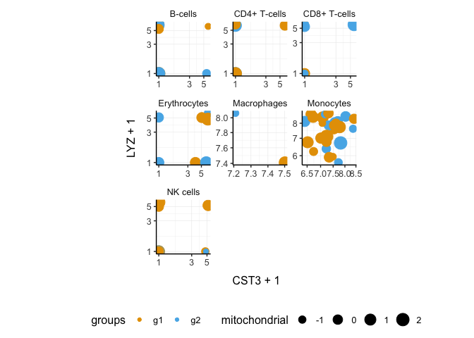
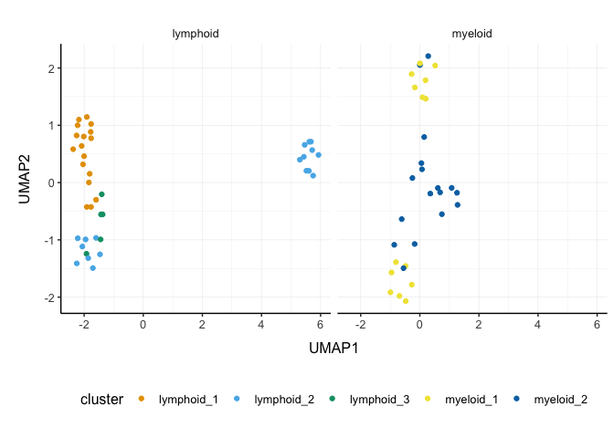

tidySingleCellExperiment - part of tidytranscriptomics
================

<!-- badges: start -->

[](https://www.tidyverse.org/lifecycle/#maturing)
[](https://github.com/stemangiola/tidySingleCellExperiment/actions)
<!-- badges: end -->

**Brings SingleCellExperiment to the tidyverse!**

Website:
[tidySingleCellExperiment](https://stemangiola.github.io/tidySingleCellExperiment/articles/introduction.html)

Please also have a look at

-   [tidyseurat](https://stemangiola.github.io/tidyseurat/) for tidy
    manipulation of Seurat objects
-   [tidybulk](https://stemangiola.github.io/tidybulk/) for tidy bulk
    RNA-seq data analysis
-   [nanny](https://github.com/stemangiola/nanny) for tidy high-level
    data analysis and manipulation
-   [tidygate](https://github.com/stemangiola/tidygate) for adding
    custom gate information to your tibble
-   [tidyHeatmap](https://stemangiola.github.io/tidyHeatmap/) for
    heatmaps produced with tidy principles

# Introduction

tidySingleCellExperiment provides a bridge between Bioconductor
single-cell packages \[@amezquita2019orchestrating\] and the tidyverse
\[@wickham2019welcome\]. It creates an invisible layer that enables
viewing the Bioconductor *SingleCellExperiment* object as a tidyverse
tibble, and provides SingleCellExperiment-compatible *dplyr*, *tidyr*,
*ggplot* and *plotly* functions. This allows users to get the best of
both Bioconductor and tidyverse worlds.

## Functions/utilities available

| SingleCellExperiment-compatible Functions | Description                                                                        |
|-------------------------------------------|------------------------------------------------------------------------------------|
| `all`                                     | After all `tidySingleCellExperiment` is a SingleCellExperiment object, just better |

| tidyverse Packages | Description                                                                  |
|--------------------|------------------------------------------------------------------------------|
| `dplyr`            | All `dplyr` tibble functions (e.g. `tidySingleCellExperiment::select`)       |
| `tidyr`            | All `tidyr` tibble functions (e.g. `tidySingleCellExperiment::pivot_longer`) |
| `ggplot2`          | `ggplot` (`tidySingleCellExperiment::ggplot`)                                |
| `plotly`           | `plot_ly` (`tidySingleCellExperiment::plot_ly`)                              |

| Utilities        | Description                                                                       |
|------------------|-----------------------------------------------------------------------------------|
| `tidy`           | Add `tidySingleCellExperiment` invisible layer over a SingleCellExperiment object |
| `as_tibble`      | Convert cell-wise information to a `tbl_df`                                       |
| `join_features`  | Add feature-wise information, returns a `tbl_df`                                  |
| `aggregate_cells`| Aggregate expression data within cell groups                                      |


## Installation

``` r
if (!requireNamespace("BiocManager", quietly=TRUE))
    install.packages("BiocManager")

BiocManager::install("tidySingleCellExperiment")
```

Load libraries used in this vignette.

``` r
# Bioconductor single-cell packages
library(scater)
library(scran)
library(SingleR)
library(SingleCellSignalR)

# Tidyverse-compatible packages
library(ggplot2)
library(purrr)
library(tidyHeatmap)

# Both
library(tidySingleCellExperiment)
```

# Create `tidySingleCellExperiment`, the best of both worlds!

This is a *SingleCellExperiment* object but it is evaluated as a tibble.
So it is compatible both with SingleCellExperiment and tidyverse.

``` r
pbmc_small_tidy <- tidySingleCellExperiment::pbmc_small 
```

**It looks like a tibble**

``` r
pbmc_small_tidy
```

    ## # A SingleCellExperiment-tibble abstraction: 80 × 17
    ## # [90mFeatures=230 | Cells=80 | Assays=counts, logcounts[0m
    ##    .cell      orig.…¹ nCoun…² nFeat…³ RNA_s…⁴ lette…⁵ groups RNA_s…⁶ file  ident
    ##    <chr>      <fct>     <dbl>   <int> <fct>   <fct>   <chr>  <fct>   <chr> <fct>
    ##  1 ATGCCAGAA… Seurat…      70      47 0       A       g2     0       ../d… 0    
    ##  2 CATGGCCTG… Seurat…      85      52 0       A       g1     0       ../d… 0    
    ##  3 GAACCTGAT… Seurat…      87      50 1       B       g2     0       ../d… 0    
    ##  4 TGACTGGAT… Seurat…     127      56 0       A       g2     0       ../d… 0    
    ##  5 AGTCAGACT… Seurat…     173      53 0       A       g2     0       ../d… 0    
    ##  6 TCTGATACA… Seurat…      70      48 0       A       g1     0       ../d… 0    
    ##  7 TGGTATCTA… Seurat…      64      36 0       A       g1     0       ../d… 0    
    ##  8 GCAGCTCTG… Seurat…      72      45 0       A       g1     0       ../d… 0    
    ##  9 GATATAACA… Seurat…      52      36 0       A       g1     0       ../d… 0    
    ## 10 AATGTTGAC… Seurat…     100      41 0       A       g1     0       ../d… 0    
    ## # … with 70 more rows, 7 more variables: PC_1 <dbl>, PC_2 <dbl>, PC_3 <dbl>,
    ## #   PC_4 <dbl>, PC_5 <dbl>, tSNE_1 <dbl>, tSNE_2 <dbl>, and abbreviated
    ## #   variable names ¹​orig.ident, ²​nCount_RNA, ³​nFeature_RNA, ⁴​RNA_snn_res.0.8,
    ## #   ⁵​letter.idents, ⁶​RNA_snn_res.1
    ## # ℹ Use `print(n = ...)` to see more rows, and `colnames()` to see all variable names

**But it is a SingleCellExperiment object after all**

``` r
assay(pbmc_small_tidy, "counts")[1:5, 1:5]
```

    ## 5 x 5 sparse Matrix of class "dgCMatrix"
    ##         ATGCCAGAACGACT CATGGCCTGTGCAT GAACCTGATGAACC TGACTGGATTCTCA
    ## MS4A1                .              .              .              .
    ## CD79B                1              .              .              .
    ## CD79A                .              .              .              .
    ## HLA-DRA              .              1              .              .
    ## TCL1A                .              .              .              .
    ##         AGTCAGACTGCACA
    ## MS4A1                .
    ## CD79B                .
    ## CD79A                .
    ## HLA-DRA              1
    ## TCL1A                .

# Annotation polishing

We may have a column that contains the directory each run was taken
from, such as the “file” column in `pbmc_small_tidy`.

``` r
pbmc_small_tidy$file[1:5]
```

    ## [1] "../data/sample2/outs/filtered_feature_bc_matrix/"
    ## [2] "../data/sample1/outs/filtered_feature_bc_matrix/"
    ## [3] "../data/sample2/outs/filtered_feature_bc_matrix/"
    ## [4] "../data/sample2/outs/filtered_feature_bc_matrix/"
    ## [5] "../data/sample2/outs/filtered_feature_bc_matrix/"

We may want to extract the run/sample name out of it into a separate
column. Tidyverse `extract` can be used to convert a character column
into multiple columns using regular expression groups.

``` r
# Create sample column
pbmc_small_polished <-
    pbmc_small_tidy %>%
    extract(file, "sample", "../data/([a-z0-9]+)/outs.+", remove=FALSE)

# Reorder to have sample column up front
pbmc_small_polished %>%
    select(sample, everything())
```

    ## # A SingleCellExperiment-tibble abstraction: 80 × 18
    ## # [90mFeatures=230 | Cells=80 | Assays=counts, logcounts[0m
    ##    .cell     sample orig.…¹ nCoun…² nFeat…³ RNA_s…⁴ lette…⁵ groups RNA_s…⁶ file 
    ##    <chr>     <chr>  <fct>     <dbl>   <int> <fct>   <fct>   <chr>  <fct>   <chr>
    ##  1 ATGCCAGA… sampl… Seurat…      70      47 0       A       g2     0       ../d…
    ##  2 CATGGCCT… sampl… Seurat…      85      52 0       A       g1     0       ../d…
    ##  3 GAACCTGA… sampl… Seurat…      87      50 1       B       g2     0       ../d…
    ##  4 TGACTGGA… sampl… Seurat…     127      56 0       A       g2     0       ../d…
    ##  5 AGTCAGAC… sampl… Seurat…     173      53 0       A       g2     0       ../d…
    ##  6 TCTGATAC… sampl… Seurat…      70      48 0       A       g1     0       ../d…
    ##  7 TGGTATCT… sampl… Seurat…      64      36 0       A       g1     0       ../d…
    ##  8 GCAGCTCT… sampl… Seurat…      72      45 0       A       g1     0       ../d…
    ##  9 GATATAAC… sampl… Seurat…      52      36 0       A       g1     0       ../d…
    ## 10 AATGTTGA… sampl… Seurat…     100      41 0       A       g1     0       ../d…
    ## # … with 70 more rows, 8 more variables: ident <fct>, PC_1 <dbl>, PC_2 <dbl>,
    ## #   PC_3 <dbl>, PC_4 <dbl>, PC_5 <dbl>, tSNE_1 <dbl>, tSNE_2 <dbl>, and
    ## #   abbreviated variable names ¹​orig.ident, ²​nCount_RNA, ³​nFeature_RNA,
    ## #   ⁴​RNA_snn_res.0.8, ⁵​letter.idents, ⁶​RNA_snn_res.1
    ## # ℹ Use `print(n = ...)` to see more rows, and `colnames()` to see all variable names

# Preliminary plots

Set colours and theme for plots.

``` r
# Use colourblind-friendly colours
friendly_cols <- dittoSeq::dittoColors()

# Set theme
custom_theme <-
    list(
        scale_fill_manual(values=friendly_cols),
        scale_color_manual(values=friendly_cols),
        theme_bw() +
            theme(
                panel.border=element_blank(),
                axis.line=element_line(),
                panel.grid.major=element_line(size=0.2),
                panel.grid.minor=element_line(size=0.1),
                text=element_text(size=12),
                legend.position="bottom",
                aspect.ratio=1,
                strip.background=element_blank(),
                axis.title.x=element_text(margin=margin(t=10, r=10, b=10, l=10)),
                axis.title.y=element_text(margin=margin(t=10, r=10, b=10, l=10))
            )
    )
```

We can treat `pbmc_small_polished` as a tibble for plotting.

Here we plot number of features per cell.

``` r
pbmc_small_polished %>%
    tidySingleCellExperiment::ggplot(aes(nFeature_RNA, fill=groups)) +
    geom_histogram() +
    custom_theme
```

    ## `stat_bin()` using `bins = 30`. Pick better value with `binwidth`.

<!-- -->

Here we plot total features per cell.

``` r
pbmc_small_polished %>%
    tidySingleCellExperiment::ggplot(aes(groups, nCount_RNA, fill=groups)) +
    geom_boxplot(outlier.shape=NA) +
    geom_jitter(width=0.1) +
    custom_theme
```

<!-- -->

Here we plot abundance of two features for each group.

``` r
pbmc_small_polished %>%
    join_features(features=c("HLA-DRA", "LYZ")) %>%
    ggplot(aes(groups, .abundance_counts + 1, fill=groups)) +
    geom_boxplot(outlier.shape=NA) +
    geom_jitter(aes(size=nCount_RNA), alpha=0.5, width=0.2) +
    scale_y_log10() +
    custom_theme
```

    ## tidySingleCellExperiment says: This operation lead to duplicated cell names. A data frame is returned for independent data analysis.

<!-- -->

# Preprocess the dataset

We can also treat `pbmc_small_polished` as a *SingleCellExperiment*
object and proceed with data processing with Bioconductor packages, such
as *scran* \[@lun2016pooling\] and *scater* \[@mccarthy2017scater\].

``` r
# Identify variable genes with scran
variable_genes <-
    pbmc_small_polished %>%
    modelGeneVar() %>%
    getTopHVGs(prop=0.1)

# Perform PCA with scater
pbmc_small_pca <-
    pbmc_small_polished %>%
    runPCA(subset_row=variable_genes)
```

    ## Warning in check_numbers(k = k, nu = nu, nv = nv, limit = min(dim(x)) - : more
    ## singular values/vectors requested than available

    ## Warning in (function (A, nv = 5, nu = nv, maxit = 1000, work = nv + 7, reorth =
    ## TRUE, : You're computing too large a percentage of total singular values, use a
    ## standard svd instead.

``` r
pbmc_small_pca
```

    ## # A SingleCellExperiment-tibble abstraction: 80 × 18
    ## # [90mFeatures=230 | Cells=80 | Assays=counts, logcounts[0m
    ##    .cell     orig.…¹ nCoun…² nFeat…³ RNA_s…⁴ lette…⁵ groups RNA_s…⁶ file  sample
    ##    <chr>     <fct>     <dbl>   <int> <fct>   <fct>   <chr>  <fct>   <chr> <chr> 
    ##  1 ATGCCAGA… Seurat…      70      47 0       A       g2     0       ../d… sampl…
    ##  2 CATGGCCT… Seurat…      85      52 0       A       g1     0       ../d… sampl…
    ##  3 GAACCTGA… Seurat…      87      50 1       B       g2     0       ../d… sampl…
    ##  4 TGACTGGA… Seurat…     127      56 0       A       g2     0       ../d… sampl…
    ##  5 AGTCAGAC… Seurat…     173      53 0       A       g2     0       ../d… sampl…
    ##  6 TCTGATAC… Seurat…      70      48 0       A       g1     0       ../d… sampl…
    ##  7 TGGTATCT… Seurat…      64      36 0       A       g1     0       ../d… sampl…
    ##  8 GCAGCTCT… Seurat…      72      45 0       A       g1     0       ../d… sampl…
    ##  9 GATATAAC… Seurat…      52      36 0       A       g1     0       ../d… sampl…
    ## 10 AATGTTGA… Seurat…     100      41 0       A       g1     0       ../d… sampl…
    ## # … with 70 more rows, 8 more variables: ident <fct>, PC1 <dbl>, PC2 <dbl>,
    ## #   PC3 <dbl>, PC4 <dbl>, PC5 <dbl>, tSNE_1 <dbl>, tSNE_2 <dbl>, and
    ## #   abbreviated variable names ¹​orig.ident, ²​nCount_RNA, ³​nFeature_RNA,
    ## #   ⁴​RNA_snn_res.0.8, ⁵​letter.idents, ⁶​RNA_snn_res.1
    ## # ℹ Use `print(n = ...)` to see more rows, and `colnames()` to see all variable names

If a tidyverse-compatible package is not included in the
tidySingleCellExperiment collection, we can use `as_tibble` to
permanently convert `tidySingleCellExperiment` into a tibble.

``` r
# Create pairs plot with GGally
pbmc_small_pca %>%
    as_tibble() %>%
    select(contains("PC"), everything()) %>%
    GGally::ggpairs(columns=1:5, ggplot2::aes(colour=groups)) +
    custom_theme
```

    ## Registered S3 method overwritten by 'GGally':
    ##   method from   
    ##   +.gg   ggplot2

<!-- -->

# Identify clusters

We can proceed with cluster identification with *scran*.

``` r
pbmc_small_cluster <- pbmc_small_pca

# Assign clusters to the 'colLabels' of the SingleCellExperiment object
colLabels(pbmc_small_cluster) <-
    pbmc_small_pca %>%
    buildSNNGraph(use.dimred="PCA") %>%
    igraph::cluster_walktrap() %$%
    membership %>%
    as.factor()
```

    ## Warning in (function (to_check, X, clust_centers, clust_info, dtype, nn, :
    ## detected tied distances to neighbors, see ?'BiocNeighbors-ties'

``` r
# Reorder columns
pbmc_small_cluster %>% select(label, everything())
```

    ## # A SingleCellExperiment-tibble abstraction: 80 × 19
    ## # [90mFeatures=230 | Cells=80 | Assays=counts, logcounts[0m
    ##    .cell      label orig.…¹ nCoun…² nFeat…³ RNA_s…⁴ lette…⁵ groups RNA_s…⁶ file 
    ##    <chr>      <fct> <fct>     <dbl>   <int> <fct>   <fct>   <chr>  <fct>   <chr>
    ##  1 ATGCCAGAA… 2     Seurat…      70      47 0       A       g2     0       ../d…
    ##  2 CATGGCCTG… 2     Seurat…      85      52 0       A       g1     0       ../d…
    ##  3 GAACCTGAT… 2     Seurat…      87      50 1       B       g2     0       ../d…
    ##  4 TGACTGGAT… 1     Seurat…     127      56 0       A       g2     0       ../d…
    ##  5 AGTCAGACT… 2     Seurat…     173      53 0       A       g2     0       ../d…
    ##  6 TCTGATACA… 2     Seurat…      70      48 0       A       g1     0       ../d…
    ##  7 TGGTATCTA… 1     Seurat…      64      36 0       A       g1     0       ../d…
    ##  8 GCAGCTCTG… 2     Seurat…      72      45 0       A       g1     0       ../d…
    ##  9 GATATAACA… 2     Seurat…      52      36 0       A       g1     0       ../d…
    ## 10 AATGTTGAC… 2     Seurat…     100      41 0       A       g1     0       ../d…
    ## # … with 70 more rows, 9 more variables: sample <chr>, ident <fct>, PC1 <dbl>,
    ## #   PC2 <dbl>, PC3 <dbl>, PC4 <dbl>, PC5 <dbl>, tSNE_1 <dbl>, tSNE_2 <dbl>, and
    ## #   abbreviated variable names ¹​orig.ident, ²​nCount_RNA, ³​nFeature_RNA,
    ## #   ⁴​RNA_snn_res.0.8, ⁵​letter.idents, ⁶​RNA_snn_res.1
    ## # ℹ Use `print(n = ...)` to see more rows, and `colnames()` to see all variable names

And interrogate the output as if it was a regular tibble.

``` r
# Count number of cells for each cluster per group
pbmc_small_cluster %>%
    tidySingleCellExperiment::count(groups, label)
```

    ## tidySingleCellExperiment says: A data frame is returned for independent data analysis.

    ## # A tibble: 8 × 3
    ##   groups label     n
    ##   <chr>  <fct> <int>
    ## 1 g1     1        12
    ## 2 g1     2        14
    ## 3 g1     3        14
    ## 4 g1     4         4
    ## 5 g2     1        10
    ## 6 g2     2        11
    ## 7 g2     3        10
    ## 8 g2     4         5

We can identify and visualise cluster markers combining
SingleCellExperiment, tidyverse functions and tidyHeatmap
\[@mangiola2020tidyheatmap\]

``` r
# Identify top 10 markers per cluster
marker_genes <-
    pbmc_small_cluster %>%
    findMarkers(groups=pbmc_small_cluster$label) %>%
    as.list() %>%
    map(~ .x %>%
        head(10) %>%
        rownames()) %>%
    unlist()

# Plot heatmap
pbmc_small_cluster %>%
    join_features(features=marker_genes) %>%
    group_by(label) %>%
    heatmap(.feature, .cell, .abundance_counts, .scale="column")
```

    ## tidySingleCellExperiment says: This operation lead to duplicated cell names. A data frame is returned for independent data analysis.

    ## tidyHeatmap says: (once per session) from release 1.7.0 the scaling is set to "none" by default. Please use scale = "row", "column" or "both" to apply scaling

    ## Warning: The `.scale` argument of `heatmap()` is deprecated as of tidyHeatmap 1.7.0.
    ## Please use scale (without dot prefix) instead: heatmap(scale = ...)
    ## This warning is displayed once every 8 hours.
    ## Call `lifecycle::last_lifecycle_warnings()` to see where this warning was generated.

<!-- -->

# Reduce dimensions

We can calculate the first 3 UMAP dimensions using the
SingleCellExperiment framework and *scater*.

``` r
pbmc_small_UMAP <-
    pbmc_small_cluster %>%
    runUMAP(ncomponents=3)
```

And we can plot the result in 3D using plotly.

``` r
pbmc_small_UMAP %>%
    plot_ly(
        x=~`UMAP1`,
        y=~`UMAP2`,
        z=~`UMAP3`,
        color=~label,
        colors=friendly_cols[1:4]
    )
```


# Cell type prediction

We can infer cell type identities using *SingleR* \[@aran2019reference\]
and manipulate the output using tidyverse.

``` r
# Get cell type reference data
blueprint <- celldex::BlueprintEncodeData()

# Infer cell identities
cell_type_df <-

    assays(pbmc_small_UMAP)$logcounts %>%
    Matrix::Matrix(sparse = TRUE) %>%
    SingleR::SingleR(
        ref = blueprint,
        labels = blueprint$label.main,
        method = "single"
    ) %>%
    as.data.frame() %>%
    as_tibble(rownames="cell") %>%
    select(cell, first.labels)
```

``` r
# Join UMAP and cell type info
pbmc_small_cell_type <-
    pbmc_small_UMAP %>%
    left_join(cell_type_df, by="cell")
```

    ## Warning in is_sample_feature_deprecated_used(x, when(by, !is.null(.) ~ by, :
    ## tidySingleCellExperiment says: from version 1.3.1, the special columns including
    ## cell id (colnames(se)) has changed to ".cell". This dataset is returned with
    ## the old-style vocabulary (cell), however we suggest to update your workflow to
    ## reflect the new vocabulary (.cell)

``` r
# Reorder columns
pbmc_small_cell_type %>%
    tidySingleCellExperiment::select(cell, first.labels, everything())
```

    ## Warning in is_sample_feature_deprecated_used(.data, (enquos(..., .ignore_empty
    ## = "all") %>% : tidySingleCellExperiment says: from version 1.3.1, the special
    ## columns including cell id (colnames(se)) has changed to ".cell". This dataset is
    ## returned with the old-style vocabulary (cell), however we suggest to update your
    ## workflow to reflect the new vocabulary (.cell)

    ## # A SingleCellExperiment-tibble abstraction: 80 × 23
    ## # [90mFeatures=230 | Cells=80 | Assays=counts, logcounts[0m
    ##    cell     first…¹ orig.…² nCoun…³ nFeat…⁴ RNA_s…⁵ lette…⁶ groups RNA_s…⁷ file 
    ##    <chr>    <chr>   <fct>     <dbl>   <int> <fct>   <fct>   <chr>  <fct>   <chr>
    ##  1 ATGCCAG… CD4+ T… Seurat…      70      47 0       A       g2     0       ../d…
    ##  2 CATGGCC… CD8+ T… Seurat…      85      52 0       A       g1     0       ../d…
    ##  3 GAACCTG… CD8+ T… Seurat…      87      50 1       B       g2     0       ../d…
    ##  4 TGACTGG… CD4+ T… Seurat…     127      56 0       A       g2     0       ../d…
    ##  5 AGTCAGA… CD4+ T… Seurat…     173      53 0       A       g2     0       ../d…
    ##  6 TCTGATA… CD4+ T… Seurat…      70      48 0       A       g1     0       ../d…
    ##  7 TGGTATC… CD4+ T… Seurat…      64      36 0       A       g1     0       ../d…
    ##  8 GCAGCTC… CD4+ T… Seurat…      72      45 0       A       g1     0       ../d…
    ##  9 GATATAA… CD4+ T… Seurat…      52      36 0       A       g1     0       ../d…
    ## 10 AATGTTG… CD4+ T… Seurat…     100      41 0       A       g1     0       ../d…
    ## # … with 70 more rows, 13 more variables: sample <chr>, ident <fct>,
    ## #   label <fct>, PC1 <dbl>, PC2 <dbl>, PC3 <dbl>, PC4 <dbl>, PC5 <dbl>,
    ## #   tSNE_1 <dbl>, tSNE_2 <dbl>, UMAP1 <dbl>, UMAP2 <dbl>, UMAP3 <dbl>, and
    ## #   abbreviated variable names ¹​first.labels, ²​orig.ident, ³​nCount_RNA,
    ## #   ⁴​nFeature_RNA, ⁵​RNA_snn_res.0.8, ⁶​letter.idents, ⁷​RNA_snn_res.1
    ## # ℹ Use `print(n = ...)` to see more rows, and `colnames()` to see all variable names

We can easily summarise the results. For example, we can see how cell
type classification overlaps with cluster classification.

``` r
# Count number of cells for each cell type per cluster
pbmc_small_cell_type %>%
    count(label, first.labels)
```

    ## tidySingleCellExperiment says: A data frame is returned for independent data analysis.

    ## # A tibble: 11 × 3
    ##    label first.labels     n
    ##    <fct> <chr>        <int>
    ##  1 1     CD4+ T-cells     2
    ##  2 1     CD8+ T-cells     8
    ##  3 1     NK cells        12
    ##  4 2     B-cells         10
    ##  5 2     CD4+ T-cells     6
    ##  6 2     CD8+ T-cells     2
    ##  7 2     Macrophages      1
    ##  8 2     Monocytes        6
    ##  9 3     Macrophages      1
    ## 10 3     Monocytes       23
    ## 11 4     Erythrocytes     9

We can easily reshape the data for building information-rich faceted
plots.

``` r
pbmc_small_cell_type %>%

    # Reshape and add classifier column
    pivot_longer(
        cols=c(label, first.labels),
        names_to="classifier", values_to="label"
    ) %>%

    # UMAP plots for cell type and cluster
    ggplot(aes(UMAP1, UMAP2, color=label)) +
    geom_point() +
    facet_wrap(~classifier) +
    custom_theme
```

    ## tidySingleCellExperiment says: A data frame is returned for independent data analysis.

<!-- -->

We can easily plot gene correlation per cell category, adding
multi-layer annotations.

``` r
pbmc_small_cell_type %>%

    # Add some mitochondrial abundance values
    mutate(mitochondrial=rnorm(dplyr::n())) %>%

    # Plot correlation
    join_features(features=c("CST3", "LYZ"), shape="wide") %>%
    ggplot(aes(CST3 + 1, LYZ + 1, color=groups, size=mitochondrial)) +
    geom_point() +
    facet_wrap(~first.labels, scales="free") +
    scale_x_log10() +
    scale_y_log10() +
    custom_theme
```

    ## Warning in is_sample_feature_deprecated_used(x, when(by, !is.null(.) ~ by, :
    ## tidySingleCellExperiment says: from version 1.3.1, the special columns including
    ## cell id (colnames(se)) has changed to ".cell". This dataset is returned with
    ## the old-style vocabulary (cell), however we suggest to update your workflow to
    ## reflect the new vocabulary (.cell)

<!-- -->

# Nested analyses

A powerful tool we can use with tidySingleCellExperiment is tidyverse
`nest`. We can easily perform independent analyses on subsets of the
dataset. First we classify cell types into lymphoid and myeloid, and
then nest based on the new classification.

``` r
pbmc_small_nested <-
    pbmc_small_cell_type %>%
    filter(first.labels != "Erythrocytes") %>%
    mutate(cell_class=dplyr::if_else(`first.labels` %in% c("Macrophages", "Monocytes"), "myeloid", "lymphoid")) %>%
    nest(data=-cell_class)
```

    ## Warning in is_sample_feature_deprecated_used(.data, (enquos(..., .ignore_empty
    ## = "all") %>% : tidySingleCellExperiment says: from version 1.3.1, the special
    ## columns including cell id (colnames(se)) has changed to ".cell". This dataset is
    ## returned with the old-style vocabulary (cell), however we suggest to update your
    ## workflow to reflect the new vocabulary (.cell)

    ## Warning in is_sample_feature_deprecated_used(.data, (enquos(..., .ignore_empty
    ## = "all") %>% : tidySingleCellExperiment says: from version 1.3.1, the special
    ## columns including cell id (colnames(se)) has changed to ".cell". This dataset is
    ## returned with the old-style vocabulary (cell), however we suggest to update your
    ## workflow to reflect the new vocabulary (.cell)

``` r
pbmc_small_nested
```

    ## # A tibble: 2 × 2
    ##   cell_class data           
    ##   <chr>      <list>         
    ## 1 lymphoid   <SnglCllE[,40]>
    ## 2 myeloid    <SnglCllE[,31]>

Now we can independently for the lymphoid and myeloid subsets (i) find
variable features, (ii) reduce dimensions, and (iii) cluster using both
tidyverse and SingleCellExperiment seamlessly.

``` r
pbmc_small_nested_reanalysed <-
    pbmc_small_nested %>%
    mutate(data=map(
        data, ~ {
            .x <- runPCA(.x, subset_row=variable_genes)

            variable_genes <-
                .x %>%
                modelGeneVar() %>%
                getTopHVGs(prop=0.3)

            colLabels(.x) <-
                .x %>%
                buildSNNGraph(use.dimred="PCA") %>%
                igraph::cluster_walktrap() %$%
                membership %>%
                as.factor()

            .x %>% runUMAP(ncomponents=3)
        }
    ))

pbmc_small_nested_reanalysed
```

    ## # A tibble: 2 × 2
    ##   cell_class data           
    ##   <chr>      <list>         
    ## 1 lymphoid   <SnglCllE[,40]>
    ## 2 myeloid    <SnglCllE[,31]>

We can then unnest and plot the new classification.

``` r
pbmc_small_nested_reanalysed %>%

    # Convert to tibble otherwise SingleCellExperiment drops reduced dimensions when unifying data sets.
    mutate(data=map(data, ~ .x %>% as_tibble())) %>%
    unnest(data) %>%

    # Define unique clusters
    unite("cluster", c(cell_class, label), remove=FALSE) %>%

    # Plotting
    ggplot(aes(UMAP1, UMAP2, color=cluster)) +
    geom_point() +
    facet_wrap(~cell_class) +
    custom_theme
```

<!-- -->

We can perform a large number of functional analyses on data subsets.
For example, we can identify intra-sample cell-cell interactions using
*SingleCellSignalR* \[@cabello2020singlecellsignalr\], and then compare
whether interactions are stronger or weaker across conditions. The code
below demonstrates how this analysis could be performed. It won’t work
with this small example dataset as we have just two samples (one for
each condition). But some example output is shown below and you can
imagine how you can use tidyverse on the output to perform t-tests and
visualisation.

``` r
pbmc_small_nested_interactions <-
    pbmc_small_nested_reanalysed %>%

    # Unnest based on cell category
    unnest(data) %>%

    # Create unambiguous clusters
    mutate(integrated_clusters=first.labels %>% as.factor() %>% as.integer()) %>%

    # Nest based on sample
    tidySingleCellExperiment::nest(data=-sample) %>%
    tidySingleCellExperiment::mutate(interactions=map(data, ~ {

        # Produce variables. Yuck!
        cluster <- colData(.x)$integrated_clusters
        data <- data.frame(assays(.x) %>% as.list() %>% .[[1]] %>% as.matrix())

        # Ligand/Receptor analysis using SingleCellSignalR
        data %>%
            cell_signaling(genes=rownames(data), cluster=cluster) %>%
            inter_network(data=data, signal=., genes=rownames(data), cluster=cluster) %$%
            `individual-networks` %>%
            map_dfr(~ bind_rows(as_tibble(.x)))
    }))

pbmc_small_nested_interactions %>%
    select(-data) %>%
    unnest(interactions)
```

If the dataset was not so small, and interactions could be identified,
you would see something like below.

``` r
tidySingleCellExperiment::pbmc_small_nested_interactions
```

    ## # A tibble: 100 × 9
    ##    sample  ligand         recep…¹ ligan…² recep…³ origin desti…⁴ inter…⁵ LRscore
    ##    <chr>   <chr>          <chr>   <chr>   <chr>   <chr>  <chr>   <chr>     <dbl>
    ##  1 sample1 cluster 1.PTMA cluste… PTMA    VIPR1   clust… cluste… paracr…   0.723
    ##  2 sample1 cluster 1.B2M  cluste… B2M     KLRD1   clust… cluste… paracr…   0.684
    ##  3 sample1 cluster 1.IL16 cluste… IL16    CD4     clust… cluste… paracr…   0.659
    ##  4 sample1 cluster 1.HLA… cluste… HLA-B   KLRD1   clust… cluste… paracr…   0.643
    ##  5 sample1 cluster 1.CAL… cluste… CALM1   VIPR1   clust… cluste… paracr…   0.616
    ##  6 sample1 cluster 1.HLA… cluste… HLA-E   KLRD1   clust… cluste… paracr…   0.585
    ##  7 sample1 cluster 1.GNAS cluste… GNAS    VIPR1   clust… cluste… paracr…   0.582
    ##  8 sample1 cluster 1.B2M  cluste… B2M     HFE     clust… cluste… paracr…   0.548
    ##  9 sample1 cluster 1.PTMA cluste… PTMA    VIPR1   clust… cluste… paracr…   0.704
    ## 10 sample1 cluster 1.CAL… cluste… CALM1   VIPR1   clust… cluste… paracr…   0.594
    ## # … with 90 more rows, and abbreviated variable names ¹​receptor, ²​ligand.name,
    ## #   ³​receptor.name, ⁴​destination, ⁵​interaction.type
    ## # ℹ Use `print(n = ...)` to see more rows

#  Aggregating cells 

Sometimes, it is necessary to aggregate the expression data from a group of cells into a single value. For example, when comparing groups of cells across different samples. Cells within a sample are not independent of each other and treating them as such may result in over optimistic p-values.

In tidySingleCellExperiment, cell aggregation can be achieved using the `aggregate_cells` function.
 
``` r
pbmc_small_tidy %>%
  aggregate_cells(groups, assays = "counts")
```

    ## # A SummarizedExperiment-tibble abstraction: 460 × 2
    ## # Features=230 | Samples=2 | Assays=counts
    ##    .feature .sample counts groups .aggregated_cells orig.ident    file                 feature
    ##    <chr>    <chr>    <dbl> <chr>              <int> <fct>         <chr>                <chr>
    ##  1 ACAP1    g1           9 g1                    44 SeuratProject ../data/sample1/out… ACAP1
    ##  2 ACRBP    g1          29 g1                    44 SeuratProject ../data/sample1/out… ACRBP
    ##  3 ACSM3    g1           2 g1                    44 SeuratProject ../data/sample1/out… ACSM3
    ##  4 ADAR     g1          33 g1                    44 SeuratProject ../data/sample1/out… ADAR
    ##  5 AIF1     g1         209 g1                    44 SeuratProject ../data/sample1/out… AIF1
    ##  6 AKR1C3   g1          14 g1                    44 SeuratProject ../data/sample1/out… AKR1C3
    ##  7 ALOX5AP  g1          19 g1                    44 SeuratProject ../data/sample1/out… ALOX5AP
    ##  8 ANXA2    g1          87 g1                    44 SeuratProject ../data/sample1/out… ANXA2
    ##  9 ARHGDIA  g1          23 g1                    44 SeuratProject ../data/sample1/out… ARHGDIA
    ## 10 ASGR1    g1           9 g1                    44 SeuratProject ../data/sample1/out… ASGR1
    ## # … with 40 more rows
    ## # ℹ Use `print(n = ...)` to see more rows

