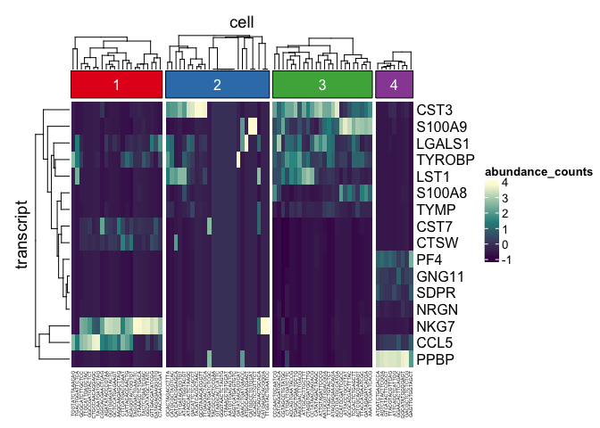
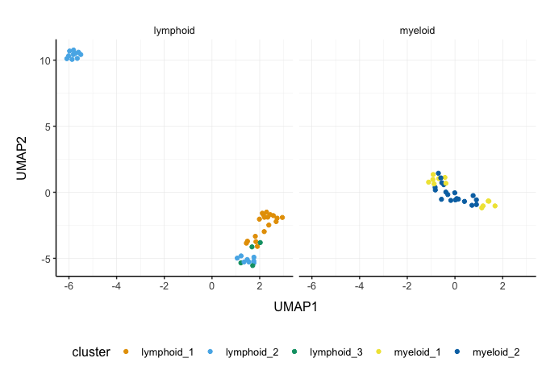

tidySCE - part of tidytranscriptomics
================

<!-- badges: start -->

<!-- badges: end -->

**Brings SingleCellExperiment to the tidyverse!**

Website:
[tidySCE](https://stemangiola.github.io/tidySCE/articles/introduction.html)

Please also have a look at

-   [tidyseurat](https://stemangiola.github.io/tidyseurat/) for tidy
    manipulation of Seurat objects
-   [tidybulk](https://stemangiola.github.io/tidybulk/) for tidy bulk
    RNA-seq data analysis
-   [nanny](https://github.com/stemangiola/nanny) for tidy high-level
    data analysis and manipulation
-   [tidygate](https://github.com/stemangiola/tidygate) for adding
    custom gate information to your tibble
-   [tidyHeatmap](https://stemangiola.github.io/tidyHeatmap/) for
    heatmaps produced with tidy principles

<!---

 

-->

Introduction
------------

tidySCE provides a bridge between Bioconductor single-cell packages and
the tidyverse. It creates an invisible layer that enables viewing the
Bioconductor *SingleCellExperiment* object as a tidyverse tibble, and
provides SingleCellExperiment-compatible *dplyr*, *tidyr*, *ggplot* and
*plotly* functions. This allows users to get the best of both
Bioconductor and tidyverse worlds.

Functions/utilities available
-----------------------------

| SingleCellExperiment-compatible Functions | Description                                                       |
|-------------------------------------------|-------------------------------------------------------------------|
| `all`                                     | After all `tidySCE` is a SingleCellExperiment object, just better |

| tidyverse Packages | Description                                          |
|--------------------|------------------------------------------------------|
| `dplyr`            | All `dplyr` functions (e.g. `tidySCE::select`)       |
| `tidyr`            | All `tidyr` functions (e.g. `tidySCE::pivot_longer`) |
| `ggplot2`          | `ggplot` (`tidySCE::ggplot`)                         |
| `plotly`           | `plot_ly` (`tidySCE::plot_ly`)                       |

| Utilities          | Description                                                                      |
|--------------------|----------------------------------------------------------------------------------|
| `tidy`             | Add `tidySCE` invisible layer over a SingleCellExperiment object                 |
| `as_tibble`        | Convert cell-wise information to a `tbl_df`                                      |
| `join_transcripts` | Add transcript-wise information, returns a `tbl_df`                              |
| `extract`          | Extract a character column into multiple columns using regular expression groups |

Installation
------------

From Bioconductor (under submission)

    if (!requireNamespace("BiocManager", quietly=TRUE))
        install.packages("BiocManager")

    BiocManager::install("tidySCE")

From Github

    devtools::install_github("stemangiola/tidySCE")

Load libraries used in this vignette.

    # Bioconductor single-cell packages
    library(scater)
    library(scran)
    library(SingleR)
    library(SingleCellSignalR)

    # Tidyverse-compatible packages
    library(dplyr)
    library(ggplot2)
    library(purrr)
    library(tidyHeatmap)

    # Both
    library(tidySCE)

Create `tidySCE`, the best of both worlds!
------------------------------------------

This is a *SingleCellExperiment* object but it is evaluated as a tibble.
So it is compatible both with SingleCellExperiment and tidyverse.

    pbmc_small_tidy <- tidySCE::pbmc_small %>% tidy()

**It looks like a tibble**

    pbmc_small_tidy

    ## # A tibble: 80 x 17
    ##    cell  orig.ident nCount_RNA nFeature_RNA RNA_snn_res.0.8 letter.idents groups
    ##    <chr> <fct>           <dbl>        <int> <fct>           <fct>         <chr> 
    ##  1 ATGC… SeuratPro…         70           47 0               A             g2    
    ##  2 CATG… SeuratPro…         85           52 0               A             g1    
    ##  3 GAAC… SeuratPro…         87           50 1               B             g2    
    ##  4 TGAC… SeuratPro…        127           56 0               A             g2    
    ##  5 AGTC… SeuratPro…        173           53 0               A             g2    
    ##  6 TCTG… SeuratPro…         70           48 0               A             g1    
    ##  7 TGGT… SeuratPro…         64           36 0               A             g1    
    ##  8 GCAG… SeuratPro…         72           45 0               A             g1    
    ##  9 GATA… SeuratPro…         52           36 0               A             g1    
    ## 10 AATG… SeuratPro…        100           41 0               A             g1    
    ## # … with 70 more rows, and 10 more variables: RNA_snn_res.1 <fct>, file <chr>,
    ## #   ident <fct>, PC_1 <dbl>, PC_2 <dbl>, PC_3 <dbl>, PC_4 <dbl>, PC_5 <dbl>,
    ## #   tSNE_1 <dbl>, tSNE_2 <dbl>

**But it is a SingleCellExperiment object after all**

    pbmc_small_tidy@assays

    ## An object of class "SimpleAssays"
    ## Slot "data":
    ## List of length 2
    ## names(2): counts logcounts

Annotation polishing using tidyverse
------------------------------------

We may have a column that contains the directory each run was taken
from, such as the “file” column in `pbmc_small_tidy`.

    pbmc_small_tidy$file[1:5]

    ## [1] "../data/sample2/outs/filtered_feature_bc_matrix/"
    ## [2] "../data/sample1/outs/filtered_feature_bc_matrix/"
    ## [3] "../data/sample2/outs/filtered_feature_bc_matrix/"
    ## [4] "../data/sample2/outs/filtered_feature_bc_matrix/"
    ## [5] "../data/sample2/outs/filtered_feature_bc_matrix/"

We may want to extract the run/sample name out of it into a separate
column. `extract` can be used to convert a character column into
multiple columns using regular expression groups.

    pbmc_small_polished <-
        pbmc_small_tidy %>%
        extract(file, "sample", "../data/([a-z0-9]+)/outs.+", remove=FALSE)

    pbmc_small_polished %>%
        select(sample, everything())

    ## # A tibble: 80 x 18
    ##    cell  sample orig.ident nCount_RNA nFeature_RNA RNA_snn_res.0.8 letter.idents
    ##    <chr> <chr>  <fct>           <dbl>        <int> <fct>           <fct>        
    ##  1 ATGC… sampl… SeuratPro…         70           47 0               A            
    ##  2 CATG… sampl… SeuratPro…         85           52 0               A            
    ##  3 GAAC… sampl… SeuratPro…         87           50 1               B            
    ##  4 TGAC… sampl… SeuratPro…        127           56 0               A            
    ##  5 AGTC… sampl… SeuratPro…        173           53 0               A            
    ##  6 TCTG… sampl… SeuratPro…         70           48 0               A            
    ##  7 TGGT… sampl… SeuratPro…         64           36 0               A            
    ##  8 GCAG… sampl… SeuratPro…         72           45 0               A            
    ##  9 GATA… sampl… SeuratPro…         52           36 0               A            
    ## 10 AATG… sampl… SeuratPro…        100           41 0               A            
    ## # … with 70 more rows, and 11 more variables: groups <chr>,
    ## #   RNA_snn_res.1 <fct>, file <chr>, ident <fct>, PC_1 <dbl>, PC_2 <dbl>,
    ## #   PC_3 <dbl>, PC_4 <dbl>, PC_5 <dbl>, tSNE_1 <dbl>, tSNE_2 <dbl>

Preliminary plots
-----------------

Set colours and theme for plots.

    # use colourblind-friendly colours
    friendly_cols <- dittoSeq::dittoColors()

    # set theme
    my_theme <-
        list(
            scale_fill_manual(values=friendly_cols),
            scale_color_manual(values=friendly_cols),
            theme_bw() +
                theme(
                    panel.border=element_blank(),
                    axis.line=element_line(),
                    panel.grid.major=element_line(size=0.2),
                    panel.grid.minor=element_line(size=0.1),
                    text=element_text(size=12),
                    legend.position="bottom",
                    aspect.ratio=1,
                    strip.background=element_blank(),
                    axis.title.x=element_text(margin=margin(t=10, r=10, b=10, l=10)),
                    axis.title.y=element_text(margin=margin(t=10, r=10, b=10, l=10))
                )
        )

We can treat `pbmc_small_polished` as a tibble for plotting.

Here we plot number of transcripts per cell.

    pbmc_small_polished %>%
        tidySCE::ggplot(aes(nFeature_RNA, fill=groups)) +
        geom_histogram() +
        my_theme

    ## `stat_bin()` using `bins = 30`. Pick better value with `binwidth`.

<!-- -->

Here we plot total transcripts per cell.

    pbmc_small_polished %>%
        tidySCE::ggplot(aes(groups, nCount_RNA, fill=groups)) +
        geom_boxplot(outlier.shape=NA) +
        geom_jitter(width=0.1) +
        my_theme

<!-- -->

Here we plot abundance of two transcripts for each group.

    pbmc_small_polished %>%
        join_transcripts(transcripts=c("HLA-DRA", "LYZ")) %>%
        ggplot(aes(groups, abundance_counts + 1, fill=groups)) +
        geom_boxplot(outlier.shape=NA) +
        geom_jitter(aes(size=nCount_RNA), alpha=0.5, width=0.2) +
        scale_y_log10() +
        my_theme

    ## tidySCE says: A data frame is returned for independent data analysis.

<!-- -->

Preprocess the dataset
----------------------

We can also treat `pbmc_small_polished` as a SingleCellExperiment object
and proceed with data processing with Bioconductor packages, such as
*scran* and *scater*.

    # identify variable genes with scran
    variable_genes <-
        pbmc_small_polished %>%
        modelGeneVar() %>%
        getTopHVGs(prop=0.1)

    # perform PCA with scater
    pbmc_small_pca <-
        pbmc_small_polished %>%
        runPCA(subset_row=variable_genes)

    ## Warning in check_numbers(k = k, nu = nu, nv = nv, limit = min(dim(x)) - : more
    ## singular values/vectors requested than available

    ## Warning in (function (A, nv = 5, nu = nv, maxit = 1000, work = nv + 7, reorth =
    ## TRUE, : You're computing too large a percentage of total singular values, use a
    ## standard svd instead.

    pbmc_small_pca

    ## # A tibble: 80 x 18
    ##    cell  orig.ident nCount_RNA nFeature_RNA RNA_snn_res.0.8 letter.idents groups
    ##    <chr> <fct>           <dbl>        <int> <fct>           <fct>         <chr> 
    ##  1 ATGC… SeuratPro…         70           47 0               A             g2    
    ##  2 CATG… SeuratPro…         85           52 0               A             g1    
    ##  3 GAAC… SeuratPro…         87           50 1               B             g2    
    ##  4 TGAC… SeuratPro…        127           56 0               A             g2    
    ##  5 AGTC… SeuratPro…        173           53 0               A             g2    
    ##  6 TCTG… SeuratPro…         70           48 0               A             g1    
    ##  7 TGGT… SeuratPro…         64           36 0               A             g1    
    ##  8 GCAG… SeuratPro…         72           45 0               A             g1    
    ##  9 GATA… SeuratPro…         52           36 0               A             g1    
    ## 10 AATG… SeuratPro…        100           41 0               A             g1    
    ## # … with 70 more rows, and 11 more variables: RNA_snn_res.1 <fct>, file <chr>,
    ## #   sample <chr>, ident <fct>, PC1 <dbl>, PC2 <dbl>, PC3 <dbl>, PC4 <dbl>,
    ## #   PC5 <dbl>, tSNE_1 <dbl>, tSNE_2 <dbl>

If a tidyverse-compatible package is not included in the tidySCE
collection, we can use `as_tibble` to permanently convert `tidySCE` into
a tibble.

    # create pairs plot with GGally
    pbmc_small_pca %>%
        as_tibble() %>%
        select(contains("PC"), everything()) %>%
        GGally::ggpairs(columns=1:5, ggplot2::aes(colour=groups)) +
        my_theme

    ## Registered S3 method overwritten by 'GGally':
    ##   method from   
    ##   +.gg   ggplot2

<!-- -->

Identify clusters
-----------------

We can proceed with cluster identification with *scran*.

    pbmc_small_cluster <- pbmc_small_pca

    # Assigning to the 'colLabels' of the SummarizedExperiment object
    colLabels(pbmc_small_cluster) <-
        pbmc_small_pca %>%
        buildSNNGraph(use.dimred="PCA") %>%
        igraph::cluster_walktrap() %$%
        membership %>%
        as.factor()

    ## Warning in (function (to_check, X, clust_centers, clust_info, dtype, nn, :
    ## detected tied distances to neighbors, see ?'BiocNeighbors-ties'

    pbmc_small_cluster %>% select(label, everything())

    ## # A tibble: 80 x 19
    ##    cell  label orig.ident nCount_RNA nFeature_RNA RNA_snn_res.0.8 letter.idents
    ##    <chr> <fct> <fct>           <dbl>        <int> <fct>           <fct>        
    ##  1 ATGC… 2     SeuratPro…         70           47 0               A            
    ##  2 CATG… 2     SeuratPro…         85           52 0               A            
    ##  3 GAAC… 2     SeuratPro…         87           50 1               B            
    ##  4 TGAC… 1     SeuratPro…        127           56 0               A            
    ##  5 AGTC… 2     SeuratPro…        173           53 0               A            
    ##  6 TCTG… 2     SeuratPro…         70           48 0               A            
    ##  7 TGGT… 1     SeuratPro…         64           36 0               A            
    ##  8 GCAG… 2     SeuratPro…         72           45 0               A            
    ##  9 GATA… 2     SeuratPro…         52           36 0               A            
    ## 10 AATG… 2     SeuratPro…        100           41 0               A            
    ## # … with 70 more rows, and 12 more variables: groups <chr>,
    ## #   RNA_snn_res.1 <fct>, file <chr>, sample <chr>, ident <fct>, PC1 <dbl>,
    ## #   PC2 <dbl>, PC3 <dbl>, PC4 <dbl>, PC5 <dbl>, tSNE_1 <dbl>, tSNE_2 <dbl>

And interrogate the output as if it was a regular tibble.

    pbmc_small_cluster %>%
        tidySCE::count(groups, label)

    ## tidySCE says: A data frame is returned for independent data analysis.

    ## # A tibble: 8 x 3
    ##   groups label     n
    ##   <chr>  <fct> <int>
    ## 1 g1     1        12
    ## 2 g1     2        14
    ## 3 g1     3        14
    ## 4 g1     4         4
    ## 5 g2     1        10
    ## 6 g2     2        11
    ## 7 g2     3        10
    ## 8 g2     4         5

We can identify and visualise cluster markers combining
SingleCellExperiment and tidyverse functions.

    # Identify markers
    marker_genes <-
        pbmc_small_cluster %>%
        findMarkers(groups=pbmc_small_cluster$label) %>%
        as.list() %>%
        map(~ .x %>%
            head(10) %>%
            rownames()) %>%
        unlist()

    # Plot heatmap
    pbmc_small_cluster %>%
        join_transcripts(transcripts=marker_genes) %>%
        group_by(label) %>%
        heatmap(transcript, cell, abundance_counts, .scale="column")

    ## tidySCE says: A data frame is returned for independent data analysis.

<!-- -->

Reduce dimensions
-----------------

We can calculate the first 3 UMAP dimensions using the
SingleCellExperiment framework and *scater*.

    pbmc_small_UMAP <-
        pbmc_small_cluster %>%
        runUMAP(ncomponents=3)

And we can plot the result in 3D using plotly.

    pbmc_small_UMAP %>%
        plot_ly(
            x=~`UMAP1`,
            y=~`UMAP2`,
            z=~`UMAP3`,
            color=~label,
            colors=friendly_cols[1:4]
        )

Cell type prediction
--------------------

We can infer cell type identities using *SingleR*.

    blueprint <- celldex::BlueprintEncodeData()

    cell_type_df <-
        pbmc_small_UMAP@assays@data$logcounts %>%
        Matrix::Matrix(sparse=TRUE) %>%
        SingleR(
            ref=blueprint,
            labels=blueprint$label.main
        ) %>%
        as.data.frame() %>%
        as_tibble(rownames="cell") %>%
        select(cell, first.labels)

    pbmc_small_cell_type <-
        pbmc_small_UMAP %>%
        left_join(cell_type_df, by="cell")

    pbmc_small_cell_type %>%
        tidySCE::select(cell, first.labels, everything())

    ## # A tibble: 80 x 23
    ##    cell  first.labels orig.ident nCount_RNA nFeature_RNA RNA_snn_res.0.8
    ##    <chr> <chr>        <fct>           <dbl>        <int> <fct>          
    ##  1 ATGC… CD4+ T-cells SeuratPro…         70           47 0              
    ##  2 CATG… CD8+ T-cells SeuratPro…         85           52 0              
    ##  3 GAAC… CD8+ T-cells SeuratPro…         87           50 1              
    ##  4 TGAC… CD4+ T-cells SeuratPro…        127           56 0              
    ##  5 AGTC… CD4+ T-cells SeuratPro…        173           53 0              
    ##  6 TCTG… CD4+ T-cells SeuratPro…         70           48 0              
    ##  7 TGGT… CD4+ T-cells SeuratPro…         64           36 0              
    ##  8 GCAG… CD4+ T-cells SeuratPro…         72           45 0              
    ##  9 GATA… CD4+ T-cells SeuratPro…         52           36 0              
    ## 10 AATG… CD4+ T-cells SeuratPro…        100           41 0              
    ## # … with 70 more rows, and 17 more variables: letter.idents <fct>,
    ## #   groups <chr>, RNA_snn_res.1 <fct>, file <chr>, sample <chr>, ident <fct>,
    ## #   label <fct>, PC1 <dbl>, PC2 <dbl>, PC3 <dbl>, PC4 <dbl>, PC5 <dbl>,
    ## #   tSNE_1 <dbl>, tSNE_2 <dbl>, UMAP1 <dbl>, UMAP2 <dbl>, UMAP3 <dbl>

We can easily summarise the results. For example, see how cell type
classification overlaps with cluster classification.

    pbmc_small_cell_type %>%
        count(label, first.labels)

    ## tidySCE says: A data frame is returned for independent data analysis.

    ## # A tibble: 11 x 3
    ##    label first.labels     n
    ##    <fct> <chr>        <int>
    ##  1 1     CD4+ T-cells     2
    ##  2 1     CD8+ T-cells     8
    ##  3 1     NK cells        12
    ##  4 2     B-cells         10
    ##  5 2     CD4+ T-cells     6
    ##  6 2     CD8+ T-cells     2
    ##  7 2     Macrophages      1
    ##  8 2     Monocytes        6
    ##  9 3     Macrophages      1
    ## 10 3     Monocytes       23
    ## 11 4     Erythrocytes     9

We can easily reshape the data for building information-rich faceted
plots.

    pbmc_small_cell_type %>%

        # Reshaping
        pivot_longer(
            cols=c(label, first.labels),
            names_to="classifier", values_to="label"
        ) %>%

        # Plotting
        ggplot(aes(UMAP1, UMAP2, color=label)) +
        geom_point() +
        facet_wrap(~classifier) +
        my_theme

    ## tidySCE says: A data frame is returned for independent data analysis.

<!-- -->

We can easily plot gene correlation per cell category, adding
multi-layer annotations.

    pbmc_small_cell_type %>%

        # Add mitochondrial abundance
        mutate(mitochondrial=rnorm(n())) %>%

        # Plot correlation
        join_transcripts(transcripts=c("CST3", "LYZ"), shape="wide") %>%
        ggplot(aes(CST3 + 1, LYZ + 1, color=groups, size=mitochondrial)) +
        geom_point() +
        facet_wrap(~first.labels, scales="free") +
        scale_x_log10() +
        scale_y_log10() +
        my_theme

    ## tidySCE says: A data frame is returned for independent data analysis.

<!-- -->

Nested analyses
---------------

A powerful tool we can use with tidySCE is `nest`. We can easily perform
independent analyses on subsets of the dataset. First we classify cell
types in lymphoid and myeloid, and then nest based on the new
classification.

    pbmc_small_nested <-
        pbmc_small_cell_type %>%
        filter(first.labels != "Erythrocytes") %>%
        mutate(cell_class=if_else(`first.labels` %in% c("Macrophages", "Monocytes"), "myeloid", "lymphoid")) %>%
        nest(data=-cell_class)

    pbmc_small_nested

    ## # A tibble: 2 x 2
    ##   cell_class data     
    ##   <chr>      <list>   
    ## 1 lymphoid   <tidySCE>
    ## 2 myeloid    <tidySCE>

Now we can independently (i) find variable features, (ii) reduce
dimensions, and (iii) cluster using both tidyverse and
SingleCellExperiment seamlessly.

    pbmc_small_nested_reanalysed <-
        pbmc_small_nested %>%
        mutate(data=map(
            data, ~ {
                .x <- runPCA(.x, subset_row=variable_genes)

                variable_genes <-
                    .x %>%
                    modelGeneVar() %>%
                    getTopHVGs(prop=0.3)

                colLabels(.x) <-
                    .x %>%
                    buildSNNGraph(use.dimred="PCA") %>%
                    igraph::cluster_walktrap() %$%
                    membership %>%
                    as.factor()

                .x %>% runUMAP(ncomponents=3)
            }
        ))

    pbmc_small_nested_reanalysed

    ## # A tibble: 2 x 2
    ##   cell_class data     
    ##   <chr>      <list>   
    ## 1 lymphoid   <tidySCE>
    ## 2 myeloid    <tidySCE>

Now we can unnest and plot the new classification.

    pbmc_small_nested_reanalysed %>%

        # Convert to tibble otherwise SingleCellExperiment drops reduced dimensions when unifying data sets.
        mutate(data=map(data, ~ .x %>% as_tibble())) %>%
        unnest(data) %>%

        # Define unique clusters
        unite("cluster", c(cell_class, label), remove=FALSE) %>%

        # Plotting
        ggplot(aes(UMAP1, UMAP2, color=cluster)) +
        geom_point() +
        facet_wrap(~cell_class) +
        my_theme

<!-- -->

We can perform a large number of functional analyses on data subsets.
For example, we can identify intra-sample cell-cell interactions, and
then compare whether interactions are stronger or weaker across
conditions. In this small dataset we have just two samples (one for each
condition) but you can imagine how you can use tidyverse on the output
to perform t-tests and visualisation.

    pbmc_small_nested_interactions <-
        pbmc_small_nested_reanalysed %>%

        # Unnest based on cell category
        unnest(data) %>%

        # Create unambiguous clusters
        mutate(integrated_clusters=first.labels %>% as.factor() %>% as.integer()) %>%

        # Nest based on sample
        tidySCE::nest(data=-sample) %>%
        tidySCE::mutate(interactions=map(data, ~ {

            # Produce variables. Yuck!
            cluster <- .x@colData$integrated_clusters
            data <- data.frame(.x@assays@data %>% as.list() %>% .[[1]] %>% as.matrix())

            # Ligand/Receptor analysis using SingleCellSignalR
            data %>%
                cell_signaling(genes=rownames(data), cluster=cluster) %>%
                inter_network(data=data, signal=., genes=rownames(data), cluster=cluster) %$%
                `individual-networks` %>%
                map_dfr(~ bind_rows(as_tibble(.x)))
        }))

    pbmc_small_nested_interactions %>%
        select(-data) %>%
        unnest(interactions)

If the data set was not so small, and interactions could be identified,
you would see something as below.

    tidySCE::pbmc_small_nested_interactions

    ## # A tibble: 100 x 9
    ##    sample ligand receptor ligand.name receptor.name origin destination
    ##    <chr>  <chr>  <chr>    <chr>       <chr>         <chr>  <chr>      
    ##  1 sampl… clust… cluster… PTMA        VIPR1         clust… cluster 2  
    ##  2 sampl… clust… cluster… B2M         KLRD1         clust… cluster 2  
    ##  3 sampl… clust… cluster… IL16        CD4           clust… cluster 2  
    ##  4 sampl… clust… cluster… HLA-B       KLRD1         clust… cluster 2  
    ##  5 sampl… clust… cluster… CALM1       VIPR1         clust… cluster 2  
    ##  6 sampl… clust… cluster… HLA-E       KLRD1         clust… cluster 2  
    ##  7 sampl… clust… cluster… GNAS        VIPR1         clust… cluster 2  
    ##  8 sampl… clust… cluster… B2M         HFE           clust… cluster 2  
    ##  9 sampl… clust… cluster… PTMA        VIPR1         clust… cluster 3  
    ## 10 sampl… clust… cluster… CALM1       VIPR1         clust… cluster 3  
    ## # … with 90 more rows, and 2 more variables: interaction.type <chr>,
    ## #   LRscore <dbl>

Session Info
============

    sessionInfo()

    ## R version 4.0.2 (2020-06-22)
    ## Platform: x86_64-apple-darwin17.0 (64-bit)
    ## Running under: macOS Mojave 10.14.6
    ## 
    ## Matrix products: default
    ## BLAS:   /Library/Frameworks/R.framework/Versions/4.0/Resources/lib/libRblas.dylib
    ## LAPACK: /Library/Frameworks/R.framework/Versions/4.0/Resources/lib/libRlapack.dylib
    ## 
    ## locale:
    ## [1] en_AU.UTF-8/en_AU.UTF-8/en_AU.UTF-8/C/en_AU.UTF-8/en_AU.UTF-8
    ## 
    ## attached base packages:
    ## [1] parallel  stats4    stats     graphics  grDevices utils     datasets 
    ## [8] methods   base     
    ## 
    ## other attached packages:
    ##  [1] tidySCE_0.99.0              tidyHeatmap_1.1.4          
    ##  [3] purrr_0.3.4                 dplyr_1.0.1                
    ##  [5] SingleCellSignalR_1.1.0     SingleR_1.3.8              
    ##  [7] scran_1.17.16               scater_1.17.4              
    ##  [9] ggplot2_3.3.2               SingleCellExperiment_1.11.6
    ## [11] SummarizedExperiment_1.19.6 DelayedArray_0.15.6        
    ## [13] matrixStats_0.56.0          Matrix_1.2-18              
    ## [15] Biobase_2.49.0              GenomicRanges_1.41.5       
    ## [17] GenomeInfoDb_1.25.8         IRanges_2.23.10            
    ## [19] S4Vectors_0.27.12           BiocGenerics_0.35.4        
    ## 
    ## loaded via a namespace (and not attached):
    ##   [1] Rtsne_0.15                ggbeeswarm_0.6.0         
    ##   [3] colorspace_1.4-1          rjson_0.2.20             
    ##   [5] ggridges_0.5.2            ellipsis_0.3.1           
    ##   [7] circlize_0.4.10           scuttle_0.99.12          
    ##   [9] bluster_0.99.1            XVector_0.29.3           
    ##  [11] GlobalOptions_0.1.2       BiocNeighbors_1.7.0      
    ##  [13] clue_0.3-57               farver_2.0.3             
    ##  [15] ggrepel_0.8.2             RSpectra_0.16-0          
    ##  [17] fansi_0.4.1               codetools_0.2-16         
    ##  [19] splines_4.0.2             knitr_1.29               
    ##  [21] cluster_2.1.0             png_0.1-7                
    ##  [23] uwot_0.1.8                pheatmap_1.0.12          
    ##  [25] BiocManager_1.30.10       compiler_4.0.2           
    ##  [27] dqrng_0.2.1               assertthat_0.2.1         
    ##  [29] limma_3.45.8              cli_2.0.2                
    ##  [31] BiocSingular_1.5.0        htmltools_0.5.0          
    ##  [33] tools_4.0.2               rsvd_1.0.3               
    ##  [35] igraph_1.2.5              gtable_0.3.0             
    ##  [37] glue_1.4.1                GenomeInfoDbData_1.2.3   
    ##  [39] Rcpp_1.0.5                vctrs_0.3.2              
    ##  [41] multtest_2.45.0           gdata_2.18.0             
    ##  [43] iterators_1.0.12          DelayedMatrixStats_1.11.1
    ##  [45] xfun_0.16                 stringr_1.4.0            
    ##  [47] lifecycle_0.2.0           irlba_2.3.3              
    ##  [49] gtools_3.8.2              statmod_1.4.34           
    ##  [51] edgeR_3.31.4              zlibbioc_1.35.0          
    ##  [53] MASS_7.3-51.6             scales_1.1.1             
    ##  [55] RColorBrewer_1.1-2        ComplexHeatmap_2.5.3     
    ##  [57] yaml_2.2.1                gridExtra_2.3            
    ##  [59] reshape_0.8.8             stringi_1.4.6            
    ##  [61] foreach_1.5.0             caTools_1.18.0           
    ##  [63] BiocParallel_1.23.2       shape_1.4.4              
    ##  [65] rlang_0.4.7               pkgconfig_2.0.3          
    ##  [67] bitops_1.0-6              pracma_2.2.9             
    ##  [69] evaluate_0.14             lattice_0.20-41          
    ##  [71] labeling_0.3              cowplot_1.0.0            
    ##  [73] tidyselect_1.1.0          GGally_2.0.0             
    ##  [75] RcppAnnoy_0.0.16          plyr_1.8.6               
    ##  [77] magrittr_1.5              R6_2.4.1                 
    ##  [79] gplots_3.0.4              generics_0.0.2           
    ##  [81] pillar_1.4.6              withr_2.2.0              
    ##  [83] survival_3.2-3            RCurl_1.98-1.2           
    ##  [85] tibble_3.0.3              crayon_1.3.4             
    ##  [87] KernSmooth_2.23-17        utf8_1.1.4               
    ##  [89] dittoSeq_1.1.7            rmarkdown_2.3            
    ##  [91] viridis_0.5.1             GetoptLong_1.0.2         
    ##  [93] locfit_1.5-9.4            grid_4.0.2               
    ##  [95] data.table_1.13.0         FNN_1.1.3                
    ##  [97] SIMLR_1.15.0              digest_0.6.25            
    ##  [99] tidyr_1.1.1               munsell_0.5.0            
    ## [101] beeswarm_0.2.3            viridisLite_0.3.0        
    ## [103] vipor_0.4.5
